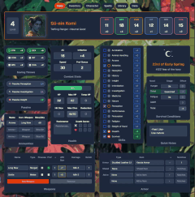

# Grimoire — D&D 5e Digital Character Sheet

A fully-featured, browser-based character sheet for Dungeons & Dragons 5th Edition. Built for players who want a fast, beautiful, and deeply customizable tool to manage every aspect of their character — from ability scores to spell slots to survival conditions — all in one place.


---

## Demo

### 🎥 YouTube Walkthrough

[](https://youtu.be/tClUF9LI6GQ)

👉 Click the image above to watch the full walkthrough on YouTube.

---

### Overview

## Features

### Character Creation & Management
- Support for **12 classes** and **10 races** with automatic ability score bonuses, skill proficiencies, and feat progression
- Full ability score system with racial bonuses, ASI choices at milestone levels, and real-time modifier calculations
- **18 skills** with proficiency/expertise tracking, automatic class & race assignment, and manual overrides
- Saving throws, proficiency bonus, and passive perception — all auto-calculated

### Combat & Stats
- **Armor Class** computed from equipped armor, shields, magical attire, and Dexterity
- **Hit Points** with current/max/temporary tracking, hit dice management, and Toughness feat support
- **Death Saves** tracker with success/failure counters
- **Weapons** grid with attack bonus, damage, finesse, range, and proficiency
- **Ammunition** tracking per weapon type
- **Survival Conditions** — hunger, thirst, and fatigue stages that feed into an exhaustion system with cascading mechanical effects
- Damage reduction and initiative modifier support

### Spellcasting
- Full **spell slot tracking** across levels 1–9 with used/remaining counters
- **Spell save DC** and **spell attack bonus** auto-calculated from class and ability scores
- **Sorcery Points** tracking for Sorcerers
- **Custom spell creation** — add homebrew spells with full details
- **Short rest / long rest** recovery buttons
- Support for all spellcasting classes including Eldritch Knight and Arcane Trickster progression

### Spell Library
- Searchable, filterable spell database
- Filter by **class**, **level**, and **school of magic**
- Toggle between known and unknown spells
- One-click add to your known/prepared list

### Inventory & Encumbrance
- **Slot-based encumbrance** system scaled by creature size (Tiny through Gargantuan)
- Separate sections for **equipped items**, **attuned items**, **backpack inventory**, and **external storage**
- **Currency tracker** with platinum, gold, electrum, silver, and copper — plus a built-in purchase calculator
- **Rations & waterskins** tracking with bulk calculations
- Magical container support

### Character & Backstory
- Full biography: true name, age, birthplace, family, physique, likes, dislikes, flaws, nicknames, and mantra
- **Personality traits**, **ideals**, **bonds**, **flaws**, and freeform backstory
- **Roleplay notes** and **character arc hooks** for narrative-driven play
- **Ability score radar chart** — hexagonal SVG visualization of your stats
- **Skills bar chart** — see your strongest and weakest skills at a glance
- Character portrait upload

### Configuration & Customization
- **Ability score rolling** with manual entry
- **ASI / Feat choices** at each milestone level
- **HP configuration** — roll or set hit points per level with bonus tracking
- **Speed** settings for walk, climb, swim, burrow, and fly
- Armor, weapon, tool, and language **proficiency management**
- Custom skill bonuses
- Background image uploads with blur control

### Atmosphere & Immersion
- **Dark mode** with full theme support across every component
- **Vibe effects** — animated particle overlays: rain, snow, fireflies, embers, sandstorm, magical aura — with opacity control
- **Weather system** — 6 weather states with visual indicators
- **In-game calendar** — track campaign days, years, and seasons

### Data Persistence
- Automatic **localStorage** save/load — your character persists across sessions
- Independent save channels for character data, spells, inventory, images, and settings
- Graceful error handling for corrupted or missing data with migration support

---

## Getting Started

### Prerequisites
- [Node.js](https://nodejs.org/) 18+
- npm, yarn, pnpm, or bun

### Installation

```bash
git clone https://github.com/PlntGoblin/testproject.git
cd testproject
npm install
```

### Run the Dev Server

```bash
npm run dev
```

Open [http://localhost:3000](http://localhost:3000) and start building your character.

### Build for Production

```bash
npm run build
npm start
```

---

## Project Structure

```
app/
├── components/
│   ├── CharacterSheet.tsx      # Main orchestrator — state management & tab routing
│   └── tabs/
│       ├── StatsTab.tsx        # Combat stats, skills, weapons, survival conditions
│       ├── CharacterTab.tsx    # Biography, backstory, visualizations
│       ├── SpellsTab.tsx       # Spell management & spell slots
│       ├── LibraryTab.tsx      # Searchable spell database
│       ├── InventoryTab.tsx    # Equipment, encumbrance, currency
│       └── DataTab.tsx         # Configuration, rolling, images, atmosphere
├── utils/
│   ├── calculations.ts         # Extracted pure D&D math functions (testable)
│   └── calculations.test.ts    # 43 unit tests covering all game calculations
├── types/
│   └── character.ts            # TypeScript interfaces
├── data/
│   └── dndConstants.ts         # D&D reference data (classes, races, feats, skills)
├── layout.tsx
└── page.tsx
docs/                           # Screenshots & GIFs for README
```

---

## Tech Stack

| Layer       | Technology              |
|-------------|-------------------------|
| Framework   | Next.js 16 (Turbopack)  |
| UI          | React 19                |
| Language    | TypeScript 5            |
| Styling     | Tailwind CSS 4          |
| Testing     | Vitest                  |
| Linting     | ESLint + Prettier       |
| Persistence | localStorage            |

---

## License

This project is for personal use. All D&D content references are property of Wizards of the Coast.
